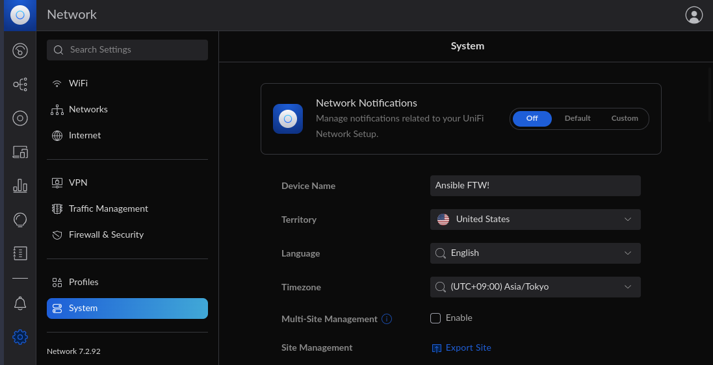

# Ansible Playbook for the Ubiquiti Unifi Network Controller Installation

An ansible playbook for installing the Unifi Network Controller.


## Supported Operating Systems

| OS | Notes
| :-- |  :-- |
| Debian 11 (bullseye) |  Recommended
| Ubuntu 22.04 LTS (jammy) |  Uses old libssl deb package for mongodb, uses focal for Adopjdk repo
| Ubuntu 20.04 LTS (flocal) | Uses old libssl deb package for mongodb

## Prerequisites

1. Ansible is installed in your PC ([instructions are here](https://docs.ansible.com/ansible/latest/installation_guide/intro_installation.html#installing-and-upgrading-ansible)).
2. One of the supported operating systems above is reachable by ssh.

## Usage

To run the playbook you will need the IP or hostname of the target server you want to install the Unifi controller on.

1. Open a terminal and run the following. The below command assumes you
````bash
TARGETPC=  # put your IP address, hostname or fqdn here. Can be comma seperated for multiple servers

ansible-playbook unifi_network_controller_setup.yml -i $TARGETPC,
````
Append the following based on your how you connect to your server
````bash
--user myusername       # To connect with a specific user account
--ask-pass              # If an SSH password is required.
--become                # for sudo escalation
--ask-become-pass       # If you need to enter a password for sudo escalation.
````
example below:
````bash
TARGETPC=192.168.2.4

ansible-playbook unifi_network_controller_setup.yml -i $TARGETPC, --ask-pass --become --ask-become-pass --user larry
````
3. After installing you should be able to access the controller by using the following url:
````
https://{controller IP or fqdn}:8443
e.g. https://192.168.4.2:8443
````
4. Then accept the warning about the invalid certificate to go through the initial setup wizard.

## Notes
- MongoDB 3.x is the only release that is currently supported by the Unifi Netowrk Controller. However 3.6 was retired in April 2021 and is now end of life. Unfortunetly until Ubiquiti improves their mongodb support, 3.6 must be installed.
- If you would like to use a valid TLS certificate I would suggest to look into [acme.sh](https://github.com/acmesh-official/acme.sh/wiki/deployhooks#23-deploy-the-cert-on-a-unifi-controller-or-cloud-key) with LetsEcrypt as it has built in support for Unifi or at least woring with the Java Keystore used by Unifi controllers.
- A the time of writting, AdoptJDK did not hava a repository releaes for 22.04 (jammy) and focal was used in its place.